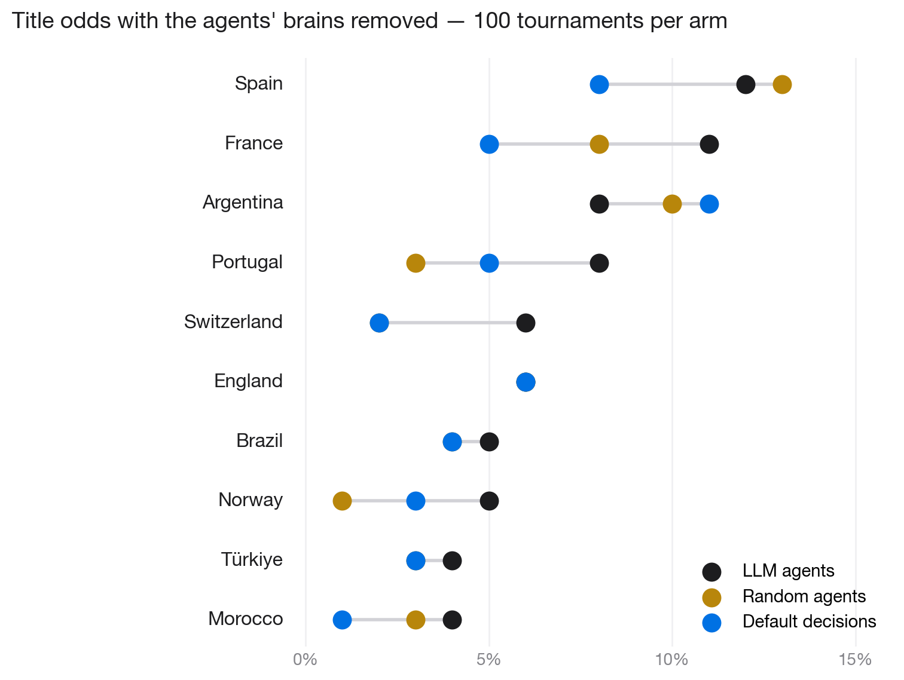
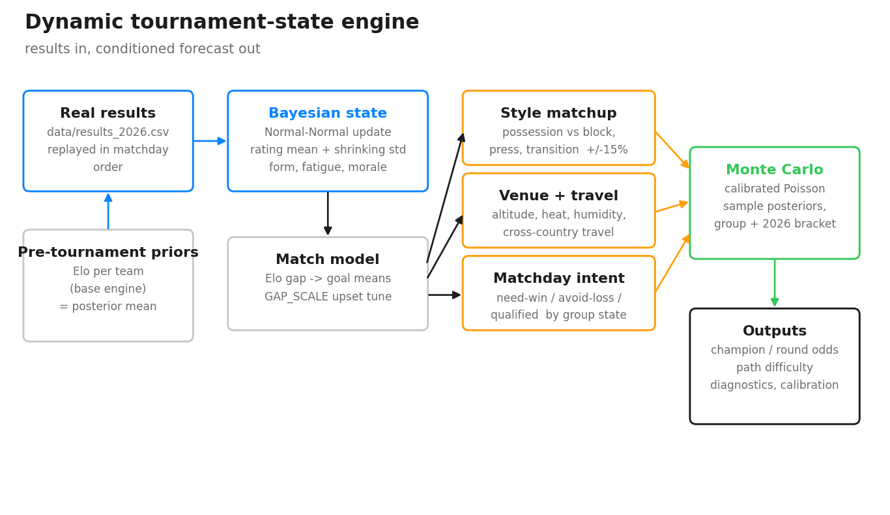
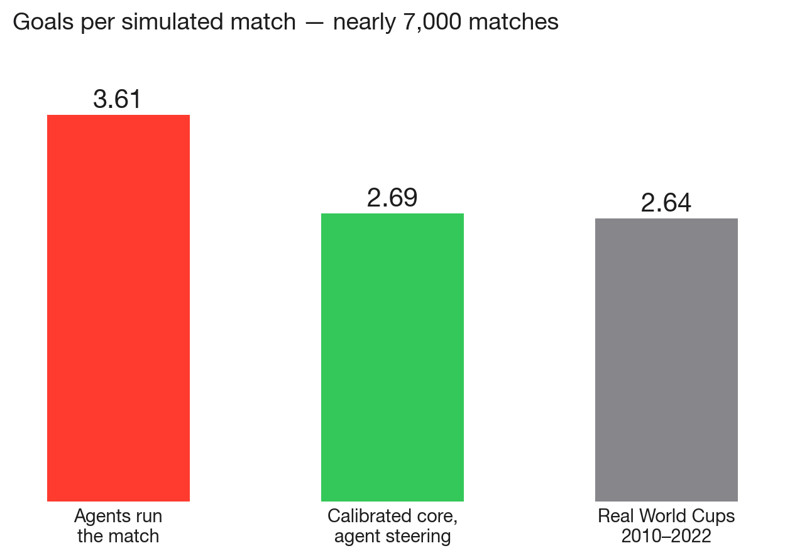

# worldcup-2026-sim

Four engines for simulating the 2026 FIFA World Cup, and the experiment that
decided which one to trust.

1. **Statistical engine** — a calibrated minute-by-minute Poisson Monte Carlo
   with an optional LLM tactical layer, backtested on the 2010–2022 World Cups.
2. **Agentic engine** — all 48 real squads, 1,248 real players, every manager,
   striker and keeper played by an LLM agent making bounded decisions inside
   the validated core. Runs on a single consumer GPU with any
   OpenAI-compatible endpoint.
3. **Prediction engine** — pure Elo-to-Poisson Monte Carlo blended with
   de-vigged bookmaker odds. 20,000 tournaments in about 8 seconds. This is
   the one that produces the numbers I'd actually bet on before kickoff.
4. **Live engine** — a dynamic tournament-state simulator (`worldcup_sim/`)
   that updates as results arrive. Strength is a Bayesian distribution that
   moves after every played match, on top of style matchups, venue and travel
   load, latent form, and matchday-aware tactics. This is the one to use once
   the tournament is actually running.

The headline finding sits in between: I ran an ablation where every agent
brain was replaced with a coin-flip, and the championship distribution didn't
change (chi-square p = 0.28, 24 vs 25 distinct champions over 100 runs each).
**Agents change the story of a match, not who wins the Cup.** Full writeup in
[`docs/WorldCup2026_Documentation.pdf`](docs/WorldCup2026_Documentation.pdf)
and [`results/ablation_results.md`](results/ablation_results.md).



## Current prediction (June 12, 2026)

Geometric blend of the Elo Monte Carlo (validated on four previous World
Cups: actual champion ranked 1st/3rd/4th/2nd) with de-vigged outright market
odds:

| Country | Win % | Elo model | Market |
|---|---|---|---|
| Spain | **27.3** | 38.9 | 15.5 |
| Argentina | **14.2** | 21.0 | 7.8 |
| France | **12.8** | 9.0 | 14.8 |
| England | **11.3** | 10.2 | 10.0 |
| Brazil | **7.0** | 4.8 | 8.1 |
| Portugal | **6.5** | 3.6 | 9.5 |

## Live engine: the forecast that moves with the tournament

The numbers above are the right answer the night before the opening game. They
are the wrong answer the moment results start landing, and the group stage of
2026 landed hard: Spain held 0-0 by Cabo Verde, Qatar drawing Switzerland,
Brazil pegged back by Morocco, Germany putting seven past Curaçao. A static
pre-tournament model cannot see any of that. The live engine is built to.

Every played match runs a Normal-Normal Bayesian update on both teams: the
rating mean moves toward what the result implies and the variance shrinks as
evidence accumulates. The Monte Carlo then samples that posterior, so an early
slip widens a team's spread of outcomes rather than just shaving a point
estimate. Style matchups (±15%), venue and travel load (Mexico City altitude,
Gulf-coast heat, cross-continent hops), latent form, and matchday tactical
intent all sit on top.



What conditioning on the first fourteen results does to the title odds, same
engine, with and without the real games fed in:

| Team | Before (pre-tournament) | After (results conditioned) |
|---|---|---|
| Spain | 22.6% | **7.9%** |
| Argentina | 18.4% | **23.8%** |
| England | 10.4% | **14.0%** |
| France | 10.4% | **13.5%** |
| Brazil | 6.0% | **5.1%** |
| Portugal | 5.4% | **6.2%** |

Spain are the story: a goalless opener against a side they were a heavy
favourite over, against a defensive block their possession game runs straight
into, drags their posterior down and cuts their title odds by two thirds.
Argentina, yet to play, inherit the favourite's slot. That is the realism the
static model was missing, and it updates the moment you add a row to a CSV.

The match model is honest about its own limits. `scripts/calibrate_upsets.py`
backtests the favourite-win, draw and underdog rates against the real
2010–2022 group stages, and `scripts/model_diagnostics.py` scores the champion
probabilities with Brier and log loss plus a calibration curve. Reports land
in [`reports/`](reports/).

## Quickstart

```bash
pip install -r requirements.txt

# the live engine: condition the forecast on results as they come in
python3 live_forecast.py --runs 4000              # reads data/results_2026.csv
python3 scripts/calibrate_upsets.py               # upset rate vs 2010-2022
python3 scripts/model_diagnostics.py              # Brier / log loss / calibration
python3 -m pytest -q                              # the test suite

# the fast static one: validate the match model, then predict 2026 pre-kickoff
python3 elo_predict.py --backtest
python3 elo_predict.py --runs 20000
python3 market_blend.py

# the statistical engine (heuristic tactics; add --llm + an OpenAI key for the agent layer)
python3 run_backtest.py
python3 run_2026.py

# the agentic engine (needs an OpenAI-compatible endpoint, e.g. local Ollama)
export WC_PLAYERS_CSV=data/players_2026_real.csv
python3 agentic_wc2026.py --demo "Spain,France"            # one verbose match
python3 agentic_wc2026.py --runs 100 --seed 2026           # full Monte Carlo
python3 agentic_wc2026.py --random-agents --runs 100       # the ablation arm
```

The agentic engine talks to any OpenAI-protocol server via `--base-url` and
`--model` (defaults to a local Ollama with qwen2.5:14b-instruct). GPU notes
for cheap cloud rentals are in [`docs/README_RUNPOD.md`](docs/README_RUNPOD.md).

## How the agentic engine stays honest

My first version let agents drive the match directly. It produced 3.61 goals
per match (real World Cups: 2.64) and 95% of goals from passing moves,
because the model likes passing and my rules rewarded it. The simulation was
measuring the LLM's personality, not football.

The shipped architecture keeps the validated Poisson core as physics and lets
agents steer at exactly three points:

- **Pre-match**: the manager's plan compiles to tactical modifiers clamped to
  roughly ±15%.
- **Every goal**: an attacker-vs-keeper duel that can deny the chance; the
  expected-goals math is compensated for the design denial rate so the
  average stays calibrated.
- **Half time**: real substitutions, with team chemistry recomputed.

Result across ~7,000 simulated matches: 2.69 goals per match, 10.1% denial
rate against a 10% target, zero silent failures (every parse fallback is
counted).



## Repository layout

```
worldcup_2026_sim.py    core engine: features, players, match model, 48-team bracket
agentic_wc2026.py       agentic engine + --random-agents ablation mode
run_2026.py             statistical Monte Carlo entry point
run_backtest.py         2010-2022 validation for the statistical engine
elo_predict.py          Elo->Poisson prediction engine (+ its own backtest)
market_blend.py         de-vig market odds, geometric blend, final table
live_forecast.py        live engine entry point: condition on real results
worldcup_sim/           dynamic state layer:
  tournament_state.py     Bayesian rating/form/fatigue updates
  styles.py               team style embeddings + matchup modifiers
  venues.py               altitude / heat / travel effects
  match_context.py        matchday tactical states
  form.py                 latent tournament form
  path_difficulty.py      bracket path strength tracking
  standings.py            group standings + 2026 tiebreakers
  engine.py               calibrated Poisson Monte Carlo, all layers wired in
scripts/                parsers, reports, figures, ablation, calibration, diagnostics
data/                   players, squads, styles, venues, live results
results/                probability tables, backtests, ablation, live forecast
reports/                upset calibration + model diagnostics
figures/                all charts incl. the v3 architecture diagram
tests/                  unit + integration tests (pytest)
docs/                   full project documentation (PDF) + GPU setup notes
MIGRATION.md            static-to-dynamic migration notes
```

## Contributing

This repo is set up so you can swap in your own ideas and measure them
against the baselines. The interesting open questions are in
[CONTRIBUTING.md](CONTRIBUTING.md) — the short version:

- **Bring your own LLM.** Everything goes through `--base-url`/`--model`.
  Does a stronger model break the ablation result?
- **Widen the clamps.** Give managers ±35% and recalibrate. Does agent
  intelligence start moving outcomes once it has real leverage?
- **Beat the blend.** The prediction engine is deliberately simple. Form
  inputs, injury data, market time series — anything that improves the
  backtest is welcome.

If you claim your agents change outcomes, include the ablation. That's the
house rule.

## License

MIT
